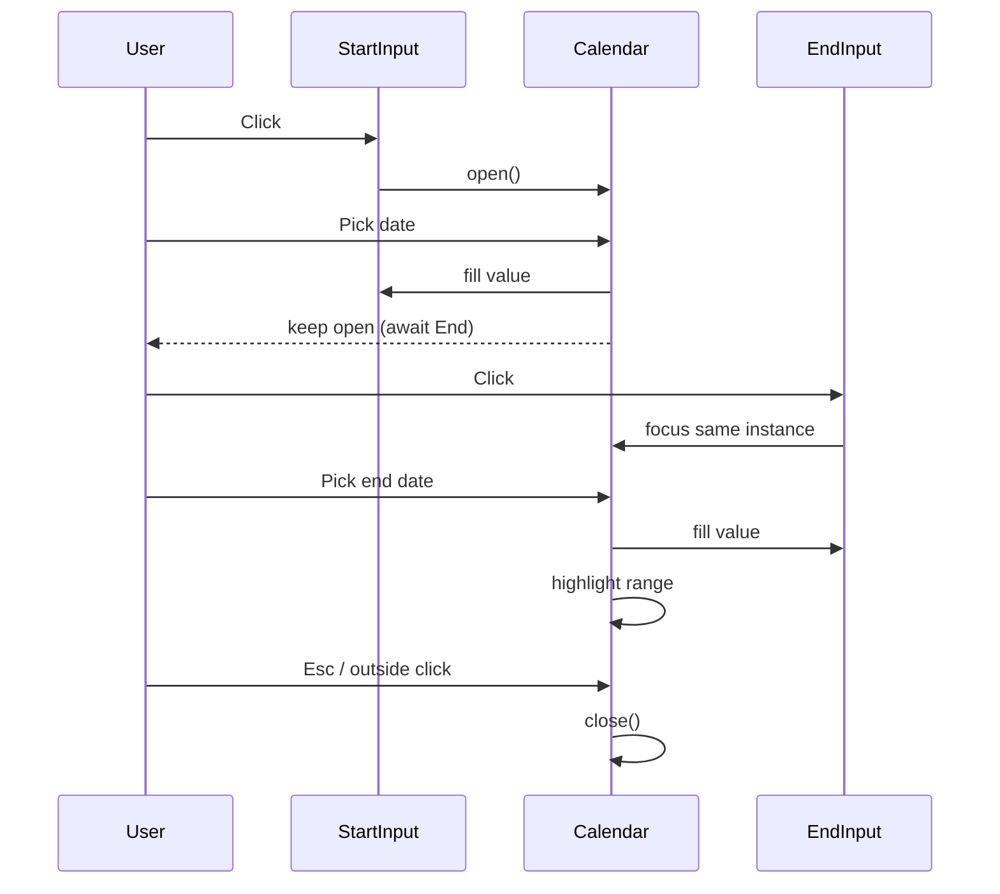

# Calendar Date Range Picker – Product Requirements Document (PRD)

## 1. Purpose  
Introduce a **date‑range picker** component (Start / End) for web forms that matches the usability of Kayak.com’s picker and the dark‑theme styling seen in the reference screenshot.

## 2. Problem Statement  
Users currently type dates manually, which is error‑prone and does not clearly convey the selected range. We need an intuitive visual picker that:

* Reduces input errors.  
* Shows both **Start** and **End** dates in a single calendar context.  
* Works across modern browsers with no heavyweight dependencies.

## 3. Goals & Success Metrics  
| Goal | Metric | Target |
|------|--------|--------|
|Accurate date entry|Form error rate|↓ 90 % vs. baseline|
|Efficiency|Avg. time to pick range|≤ 6 s (desktop)|
|Adoption|% of forms using component|100 % of new date‑range flows|
|User satisfaction|CSAT rating|≥ 4 / 5|

## 4. Non‑Goals  
* Mobile‑native date pickers (handled separately).  
* Time‑of‑day selection.  
* Recurring date ranges.

## 5. Personas & User Stories  
* **Coach Carl** – “I want to quickly select start and end dates for a wellness challenge I'm setting up for a cohort of clients.”  

### Key User Stories  
1. As a **user**, I click the **Start** field and see a calendar overlay.  
2. As a **user**, I click a date; the field fills in and the same calendar stays open, now waiting for **End**.  
2.1 As a **user**, when I hover or drag across the calendar, it shows me selection between **Start** and **End**.  
3. As a **user**, I pick an **End** date by clicking or lifting my finger; the range (Start→End) visibly highlighted on the calendar is now accepted and the **Start** and **End** fields are updated.  
4. As a **user**, I can re‑open either field to adjust the range.  
5. As a **user**, I cannot set End earlier than Start; the UI prevents or auto‑swaps the values.  

## 6. Functional Requirements  
| ID | Requirement |
|----|-------------|
|F‑1|Two read‑only text inputs labelled **Start** and **End**.|
|F‑2|Calendar opens on focus/ click of either input, positioned under the fields.|
|F‑3|Single calendar instance supports **range** mode; both selected dates remain highlighted.|
|F‑4|Hover preview shades the provisional range during End‑date selection (Kayak behaviour).|
|F‑5|Keyboard: ← → ↑ ↓ to move; **Enter** to select; **Esc** closes.|
|F‑6|Validation: End ≥ Start; otherwise block input or auto‑swap.|
|F‑7|Expose change events (`onRangeChange(start, end)`).|
|F‑8|Disable dates via min/max props (passed through to library).|

## 7. Non‑Functional Requirements  
* **Performance:** initial bundle ≤ 25 kB gzipped.  
* **Accessibility:** WCAG 2.2 AA; ARIA roles for calendar grid; visible focus states.  
* **Internationalisation:** Accept locale + first‑day‑of‑week props.  
* **Browser support:** Chrome v116+, Firefox 115+, Safari 17+, Edge 116, iOS 16+.  

## 8. Proposed Technology  
| Criteria | Flatpickr (v4.6.x) | Litepicker | jQuery UI |
|----------|-------------------|------------|-----------|
|Stars/ forks|16.4 k / 1.5 k citeturn3view0|0.9 k / 135 (archived) citeturn2view0|2.4 k (deprecated)|
|No dependencies|✅|✅|❌|
|Range mode|✅ built‑in plugin citeturn0search5|✅|✅|
|Maintained|Active|Archived|Low|
|Docs / demos|Excellent|Good|Legacy|

**Decision:** **Flatpickr** best meets requirements—modern, MIT‑licensed, actively maintained, and widely adopted.  

### Implementation Notes  
```html
<input id="start" placeholder="Start" readonly />
<input id="end"   placeholder="End"   readonly />

<script src="flatpickr.js"></script>
<script>
  flatpickr("#start", {
    mode: "range",
    dateFormat: "Y-m-d",
    onChange: (sel) => {
      const [s, e] = sel;
      if (e) { document.getElementById("end").value = e.toISOString().slice(0,10); }
    },
    onReady: (_, __, fp) => {
      // sync calendars between inputs
      document.getElementById("end").addEventListener("focus", fp.open);
    }
  });
</script>
```

## 9. Styling Guidelines  
| Token | Value | Usage |
|-------|-------|-------|
|`--clr-bg`|`#2C3948`|Calendar background|
|`--clr-fg`|`#B7BFC7`|Day labels & numerals|
|`--clr-accent`|`#1291FD`|Selected date + range highlight|
|`--font`|`"Inter", sans‑serif`|All labels|


Apply 8 px rounded corners, 12 px grid spacing, and 150 ms ease‑in animations for month navigation.

## 10. Interaction Flow  


## 11. Accessibility Checklist  
* **Role = `grid`** with `aria-label="Date range picker"`.  
* Announce selected range via `aria-live` region.  
* Ensure contrast ≥ 4.5 : 1 for all text vs. background.  

## 12. Analytics  
* Event `dateRangeSelected` `{start, end, source: 'picker'}`.  
* Time‑to‑selection (ms).  

## 13. Risks & Mitigations  
| Risk | Impact | Mitigation |
|------|--------|-----------|
|Library becomes unmaintained|Medium|Fork under org; fallback to Litepicker.|
|Large bundles|Low|Tree‑shake and lazy‑load Flatpickr CSS & JS.|
|Locale edge‑cases (RTL)|Low|Add automated tests on RTL sample locales.|

## 14. Milestones  
| Phase | Deliverable | Owner | Date |
|-------|-------------|-------|------|
|Spec freeze|Approved PRD|PM|T + 0|
|Dev spike|Prototype in Storybook|FE|T + 7 d|
|Beta|Integrated in form‑builder|FE|T + 21 d|
|GA|Rollout to 100 %|PM|T + 35 d|

## 15. Open Questions  
1. Should shortcut presets (e.g., **“Last 7 days”**) be included?  
2. Do we need an always‑visible inline variant for dashboards?  

---

© 2025
